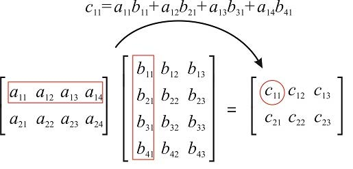

# Problem solving in C++

## Part B

### **Jump to**
  - [Question 5](#question-5)
  - [Question 10](#question-10)

---
### Question 1
Write a C++ program to create a student examination system that prints the mark sheet of students. Input student name, marks in 6 subjects. The mark should be between 0 and 100.

  - If the average of marks is >= 80 then prints Grade 'A'.
  - If the average of marks is < 80 and >= 60 then prints Grade 'B'.
  - If the average of marks is < 60 and >= 40 then prints Grade 'C'.
  - else prints Grade 'D'.

### Answer
```cpp
#include <iostream>
using namespace std;

int main() {
  string name;
  cout << "Enter Student Name: ";
  cin >> name;

  float marks[6];
  float sum = 0, i = 0;

  cout << "Enter 6 subject marks: ";
  while (i < 6) {
    cin >> marks[i];
    // Check if mark is out of range [0, 100]
    if (0 > marks[i] || marks[i] > 100) {
      cout << "Invalid Input";
      continue;
    }
    sum += marks[i]; // add it to sum
    i++;
  }

  // take average
  float avg = sum / 6;

  // Print the grades
  cout << "Grade: ";
  if (avg >= 80) cout << 'A';
  else if (avg < 80 && avg >= 60) cout << 'B';
  else if (avg < 60 && avg >= 40) cout << 'C';
  else cout << 'D';
}
```
---

### Question 2
In a company an employee is paid as under:
  - If his basic salary is less than Rs. 1500, then HRA = 10% of basic salary and DA = 90% of basic salary.
  - If his salary is either equal to or above Rs. 1500, then HRA = Rs. 500 and DA = 98% of basic salary.
  - If the employee's salary is input through the keyboard write a C++ program to find his gross salary.

Also, Elucidate on the control structure used for the above program.

### Answer
```cpp
#include <iostream>
using namespace std;

int main() {
  float bs, da, hra;

  cout << "Enter Basic Salary: ";
  cin >> bs;

  if (bs < 1500) {
    hra = bs * 10 / 100;
    da = bs * 90 / 100;
  }

  else {
    hra = 500;
    da = bs * 98 / 100;
  }

  float gs = bs + hra + da;

  cout << "Basic Salary Rs. " << bs << endl;
  cout << "HRA Rs. " << hra << endl;
  cout << "DA Rs. " << da << endl;
  cout << "Gross salary Rs. " << gs << endl;
}
```
---

### Question 3
Explain a function in C++ that accepts a string as input and finds the maximum occurring character in the string Input.

### Answer
```cpp
#include <iostream>
using namespace std;

int main() {
  string str;
  cin >> str;

  int freq[26] = { 0 };
  int maxFreq = -1;
  char maxFreqChar;
  int len = str.size();

  for (int i = 0; i < len; i++)
    freq[str[i] - 'a']++;

  for (int i = 0; i < 26; i++) {
    if (maxFreq < freq[i]) {
      maxFreq = freq[i];
      maxFreqChar = (char)(i + 'a');
    }
  }

  // Output
  cout << maxFreqChar;
}
```

---
### Question 4
Write a program to print the following pattern.
```
7 6 5 4 3 2 1
7 6 5 4 3 2
7 6 5 4 3
7 6 5 4
7 6 5
7 6
7
```

### Answer
```cpp
#include <iostream>
using namespace std;

int main() {
  int rows = 7;

  for (int i = rows; i > 0; i--) {
    for (int j = 0; j < i; j++) {
      cout << rows - j << ' ';
    }
    cout << endl;
  }
}
```

---
### Question 5
A teacher wants to compute the average of 5 students in her class. Write a program to help her to find the average. Student marks should be given in decimal format and output value should be in the float with `two decimal places`.

### Answer
```cpp
#include <iostream>
#include <iomanip>
using namespace std;

int main() {
  float m1, m2, m3, m4, m5;
  cin >> m1 >> m2 >> m3 >> m4 >> m5;

  float sum = m1 + m2 + m3 + m4 + m5;
  float avg = sum / 5;

  cout << fixed << setprecision(2) << avg;
}
```

---
### Question 6
Write a program to print the sum of factors of 3 using `continue` statement. In the same program, analyze the output if `break` is used instead of `continue` statement. Justify the above concept using while do and do while loop

### Answer
```cpp
#include <iostream>
#include <math.h>
using namespace std;

int main() {
  int num;
  cin >> num;

  int result = 0;
  for (int i = 2; i <= sqrt(num); i++) {
    // if 'i' is divisor of 'n'
    if (num % i == 0) {
      // if both divisors are same
      // then add it once else add both
      if (i == (num / i))
        result += i;
      else
        result += (i + num / i);
    }
  }

  // Add 1 and n to result as above loop
  // considers proper divisors greater than 1.
  int sum = result + num + 1;
  cout << sum;
}
```

---
### Question 7
Given an array with 'n' elements, delete an element at a particular position in the array and display the updated array. Assume that the maximum number of elements in the array is 20.

### Answer
```cpp
#include <iostream>
using namespace std;

int main() {
  int n, del_index;
  cin >> n;

  // Get the input array
  int arr[n];
  for (int i = 0; i < n; i++) {
    cin >> arr[i];
  }

  cin >> del_index;
  int arr2[n-1];

  // Process the output
  for (int i = 0, j = 0; i < n; i++) {
    if (i != del_index) {
      arr2[j++] = arr[i];
    }
  }

  // Print the modified arr
  for (int i = 0; i < n - 1; i++) {
    cout << arr2[i];
  }
}
```

---
### Question 8
Illustrate the above matrix multiplication in C++ program.



### Answer
```cpp
#include <iostream>
using namespace std;

int main() {
  int n, m, p, q;
  cin >> n >> m >> p >> q;
  
  int matrix1[n][m], matrix2[p][q];

  // Getting matrix 1
  for (int i = 0; i < n; i++) {
    for (int j = 0; j < m; j++) {
      cin >> matrix1[i][j];
    }
  }

  // Getting matrix 2
  for (int i = 0; i < p; i++) {
    for (int j = 0; j < q; j++) {
      cin >> matrix2[i][j];
    }
  }

  // Matrix Multiplication
  for (int i = 0; i < n; i++) {
    for (int j = 0; j < q; j++) {
      int sum = 0;
      for (int k = 0; k < m; k++) {
        sum += matrix1[i][k] * matrix2[k][j];
      }
      cout << sum << ' ';
    }

    cout << endl;
  }
}
```

---
### Question 9
Write a program to change the given string `"good"` to uppercase without using string library functions.

### Answer
```cpp
#include <iostream>
using namespace std;

int main() {
  string str = "good";

  for (int i = 0; i < str.size(); i++) {
    if ('a' <= str[i] && str[i] <= 'z') {
      str[i] = str[i] - 32;
    }
  }

  cout << str;
}
```

---
### Question 10
Write a program to replace a character with a given character in a string.

### Answer
```cpp
#include <iostream>
using namespace std;

int main() {
  string str;
  char target, replacer;

  cin >> str >> target >> replacer;

  for (int i = 0; i < str.size(); i++) {
    if (str[i] == target) {
      str[i] = replacer;
    }
  }

  cout << str;
}
```

